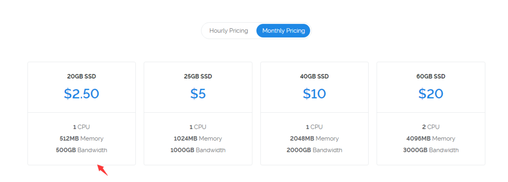
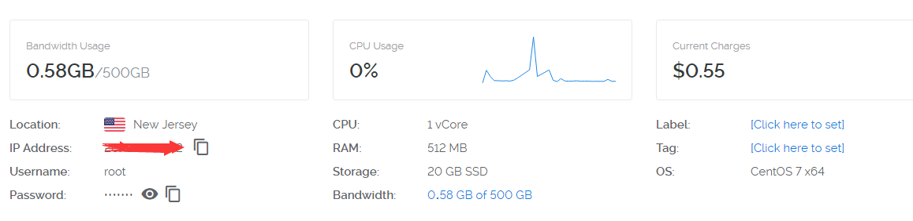
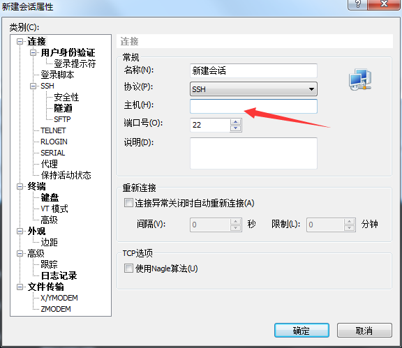
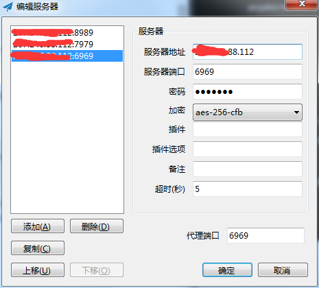
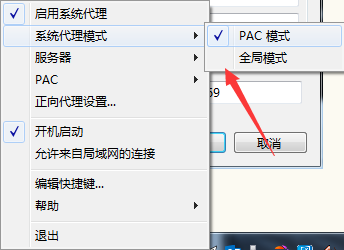

> 众所周知vpn服务基本很难找稳定的了，除了vpn访问外网，还有一种通过shadowsocks来访问的方式，这2种方式的区别请自己查询，这里详细说下从0开始怎么访问外网：

## 步骤：
- 1，你需要购买一台服务器，一个月2.5刀，一年大概199人民币，一个月流量500GB，这里推荐[vultr](https://www.vultr.com/?ref=7281490)

- 2，虽然是国外网站，但是支持支付宝扫码支付，直接美刀转人民币实时结算；优先选日本的，然后美国的，我这里选的是New Jersey，购买成功后会有ip地址

- 3，然后登录你的服务器，我这里用的是xshell客户端来登录的：

- 4，输入主机地址，然后确定后会弹出让你输入用户名，统一是root，密码输入自己的就ok了，连接好了后再进行安装ss服务：

## 安装方法如下（一路回车就好）：
```
wget --no-check-certificate https://down.upx8.com/shell/shadowsocks-go.sh
chmod +x shadowsocks-go.sh
./shadowsocks-go.sh 2>&1 | tee shadowsocks-go.log
```

## 卸载方法：

`./shadowsocks-go.sh uninstall`    

## 多端口多用户密码配置

`vi /etc/shadowsocks/config.json `   

按i粘贴以下配置，原有内容删除
```
{
"server":"0.0.0.0",
"local_address":"127.0.0.1",
"local_port":1080,
"port_password":{
"8989":"password8989",
"7979":"password7979",
"6969":"password6969"
},
"timeout":300,
"method":"aes-256-cfb",
"fast_open": false
}
```
按ESC，在输入:x，即保存推出，重启ss使其生效

`/etc/init.d/shadowsocks restart `


## 常用命令：
```
启动：/etc/init.d/shadowsocks start 
停止：/etc/init.d/shadowsocks stop 
重启：/etc/init.d/shadowsocks restart 
状态：/etc/init.d/shadowsocks status
```
如果只能用第一个账号，其他2个账号都不能用，那是防火墙对另外的端口做了限制，此时可以让防火墙不拦截 7979和6969端口

具体命令：
```
firewall-cmd --zone=public --add-port=7979/tcp --permanent
firewall-cmd --reload
```
这时候你可以试试7979的这个账号是不是可以用了

同样再设置6969
```
firewall-cmd --zone=public --add-port=6969/tcp --permanent
firewall-cmd --reload
```

如果有人问怎么用ss客户端登录，先去下载：
https://github.com/shadowsocks/shadowsocks-windows/releases

安装后打开，然后设置，服务器地址和端口号记得对应


然后代理模式选择PAC，这样省流量，你也可以全局，反正500G一个月足够用了：


还有Android和iOS请下载各自对应的客户端直接登录使用就可以了！


